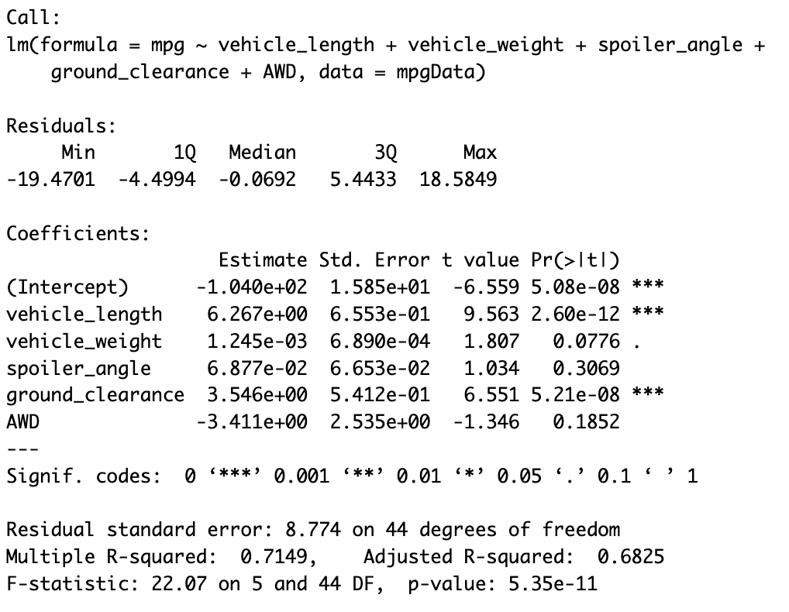
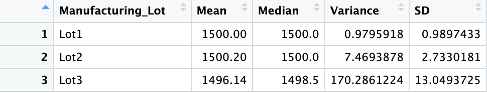
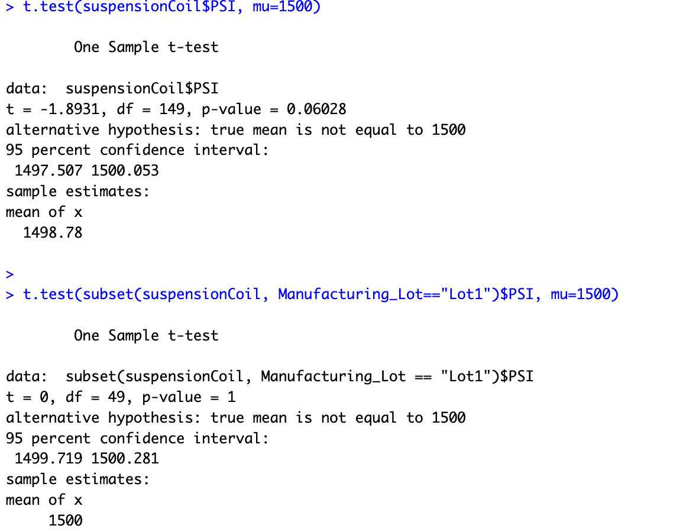
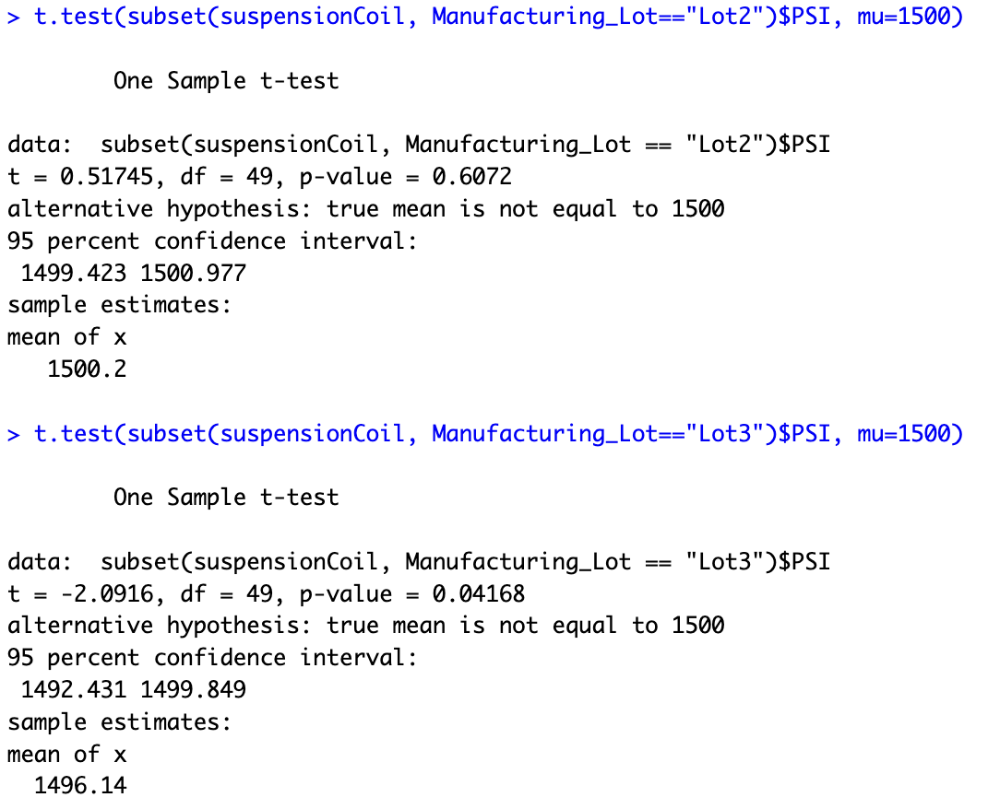

# MechaCar_Statistical_Analysis

## Linear Regression to predict MPG
As you can see in the output below the Intercept, Vehicle Length, and Ground Clearance provide a non-random amount of variance to MPG.  Meanwhile we can reject the null hypothesis that the slope is zero because our p-value is 5.35e-11.  Finally, the equation in the image below provides a decent predictor of MPG since the rsquared value is .7149, however because the intercept is one of the important factors this means we are missing other key pieces of the equation and would need to collect additional and different data to see if those acount for some of the variance.

## Summary Statistics on Suspension Coils
Below are the summary statistics for Suspension Coils, first across all of our data.

And then separated by each lot.

Given the information that variance must be less than 100 lb per square inch this would indicate that all of our samples are good to go.  However, when we look a bit more closely we can see that Lot 3 does not meet this requirement.  In other words only Lot 1 and 2 should be used.

## T-Tests on Suspension Coils
We have been told that the population average, or at least the accepted average PSI of our Suspension Coils is 1500.  So we performed 1 sample T-Tests on our data as a whole and then again across each lot.  The results of these T-Tests can be seen below with the full data result and Lot 1 in the first image and Lot 2 and 3 in the second.  Here we can see that the only result that would reject the hypothesis that the average is 1500 is for lot 3 because the p-value (.042) of the T-Test is less than the confidence interval of .05

## Study Design: MechaCar vs Competition
I am most interested in comparing the safety ratings for MechaCar vs its competition.  In order to do this we would need to select a number of safety sources, Car and Driver for example, that rate vehicles and pull these reviews/ratings for our vehicles and comparable vehicles of our competitors.  I believe it would also be important to collect important figures such as vehicle cost and average maintence cost in addition to the specifications about these vehicles (car type, class, curb weight, dimensions and footprint).  With all of this data I think we could accomplish 2 main tasks.  First would be to directly compare the safety ratings of our vehicles and those of our competitors using an Anova test witht the null hypothesis being the average safety rating does not differ across the board.  More than likely we would be able to reject this hypothesis and in that case would be being running 2 sample T-Tests with the null hypothesis that our safety rating does not differ from the selected competitor.  Doing this in tandem with summary statistics would provide a fair comparision to that of our competitors.

Secondly, with the other data we collected a regression analysis could be performed on the data as a whole to determine what (if any) factors play a signficant role in the safety rating for a vehicle.  This might provide some context for our anova/t-test results as perhaps MechaCar's fleet of vehicles are of a vehicle class that typically receives a better/worse rating.  This would skew the results when comparing the safety ratings of our competitors.